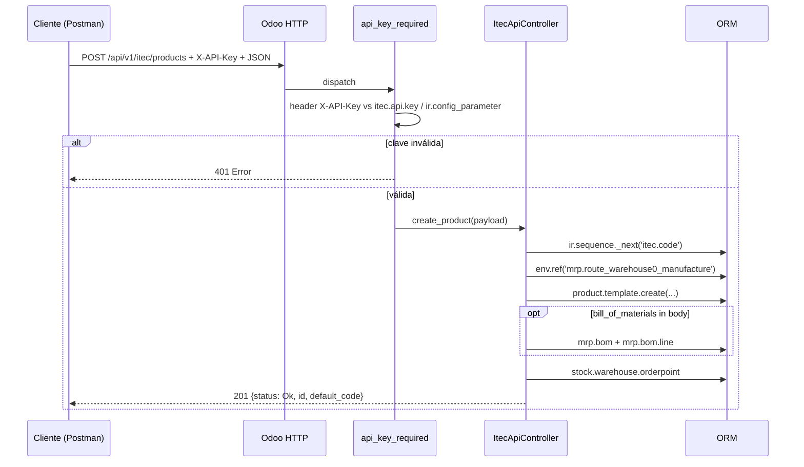
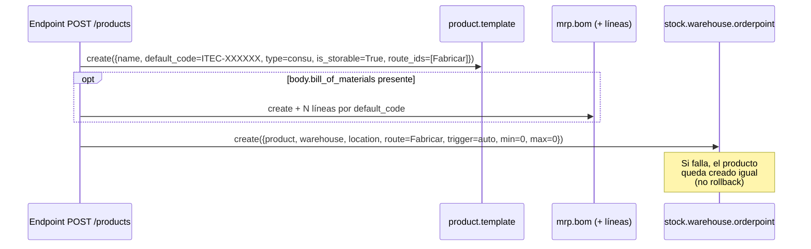

# API Itec REST (Odoo 19) — Plan de implementación y guía de Postman

Este documento explica:

1. Cómo se reemplaza el módulo legado `api_itec` por endpoints REST puros que se pueden consumir directmente desde Postman u otra app **sin necesidad de la app/middleware externa** que antes traducía REST a JSON-RPC.
2. Cómo configurar la autenticación.
3. Bodies de ejemplo, headers y respuestas esperadas para cada caso de uso.
4. Una **colección Postman v2.1** lista para importar.

---

## 1. Por qué hacía falta una app externa

El módulo `api_itec` original define los endpoints así:

```python
@http.route("/itec-api/create/product", type="json", auth="none", cors="*")
```

`type="json"` hace que Odoo exija el envelope JSON-RPC 2.0:

```json
{ "jsonrpc": "2.0", "method": "call", "params": { "...": "..." } }
```

y devuelva siempre `{ "jsonrpc": "...", "result": {...} }` con HTTP 200, incluso ante errores. Para llamarlo desde un cliente "REST normal" hacía falta una capa intermedia que envolviera/desenvolviera ese formato.

**Solución**: el módulo nuevo (`api_itec_postman`) expone los mismos casos de uso como `type="http"` con body JSON plano y respuestas HTTP estándar (200/201/400/401/404/500), sin envelopes ni cookies.

---

## 2. Arquitectura del nuevo módulo

```
EnergiaGlobal/api_itec_postman/
├── __manifest__.py                 # depends: base, product, mrp, stock
├── controllers/itec_api.py         # ItecApiController + decorador api_key
├── models/
│   ├── product_template.py         # campo sheet_type
│   └── itec_api_key.py             # tabla itec.api.key (multi-clave)
├── data/ir_sequence_data.xml       # secuencia itec.code
├── security/ir.model.access.csv    # acceso a itec.api.key
├── views/
│   ├── product_template_views.xml
│   └── itec_api_key_views.xml      # menú Ajustes → Itec API → API Keys
└── PLAN.md                         # este archivo
```

### Flujo de un request



---

## 3. Migración desde `api_itec` (importante)

Las URLs de compatibilidad `/itec-api/create/product` y `/itec-api/update/product` están redefinidas con `type="http"`, lo que **chocará con `api_itec` si ambos módulos están instalados al mismo tiempo**.

Pasos sugeridos:

1. **Backup** de la base de datos.
2. Instalar `api_itec_postman` (todavía coexiste).
3. Migrar a las URLs nuevas `/api/v1/itec/...` desde el cliente.
4. Cuando todos los integradores ya consumen las URLs nuevas, **desinstalar** `api_itec`.
5. (Opcional) Las URLs `/itec-api/...` quedan disponibles como compatibilidad REST para integraciones que aún no migraron.

> El campo `sheet_type` se redeclara en este módulo; si desinstalás `api_itec` **antes** de instalar `api_itec_postman`, vas a perder los datos del campo. Instalá primero el nuevo, valida que `sheet_type` sigue mostrando datos y recién después desinstalá el viejo.

---

## 4. Configuración de la API Key

El header válido es `X-API-Key: <token>` (también acepta `Authorization: Bearer <token>`).

Hay dos mecanismos complementarios:

### 4.1. Modelo `itec.api.key` (recomendado)

1. Ir a **Ajustes → Técnico → Itec API → API Keys** (`base.group_system`).
2. Crear un registro:
   - **Identificador**: descripción (ej.: `Postman dev`).
   - **API Key**: si lo dejás vacío, se autogenera (`secrets.token_urlsafe(36)`).
   - **Usuario asociado** (opcional): para futuras extensiones.
   - **Vence el** (opcional): caducidad.
3. Botón **Regenerar Key** invalida el token actual.

### 4.2. Parámetro de sistema (fallback)

Si preferís una única clave global:

* **Ajustes → Técnico → Parámetros de sistema** → crear `itec_api.api_key = <token>`.

El decorador valida primero contra `itec.api.key` y si no encuentra match, contra `ir.config_parameter`.

---

## 5. Endpoints

| Método | URL | Descripción |
|---|---|---|
| `POST` | `/api/v1/itec/products` | Crea `product.template`. Si llega `bill_of_materials` arma `mrp.bom`. Crea `stock.warehouse.orderpoint` (ver §6). |
| `PATCH` | `/api/v1/itec/products/<default_code>` | Actualiza por `default_code`. |
| `GET` | `/api/v1/itec/products/<default_code>` | Devuelve datos básicos del producto. |
| `POST` | `/itec-api/create/product` | **Compat** — body REST plano. |
| `POST` | `/itec-api/update/product` | **Compat** — body REST plano. |
| `OPTIONS` | (todos) | CORS preflight. |

### Headers comunes

```
X-API-Key:    {{api_key}}
Content-Type: application/json
Accept:       application/json
```

---

## 6. Comportamiento automático: regla de abastecimiento (`stock.warehouse.orderpoint`)

Cuando se crea un producto vía `POST /api/v1/itec/products`, el endpoint **no solo crea el `product.template`**: también deja al producto preconfigurado para fabricarse automáticamente. Eso lo hace creando dos cosas, en este orden:

1. La **lista de materiales** (`mrp.bom`) si llegó `bill_of_materials` en el body.
2. La **regla de abastecimiento** (`stock.warehouse.orderpoint`, también conocida como "punto de pedido" o "Min/Max").

### 6.1. ¿Qué es una regla de abastecimiento en Odoo?

En la UI estándar viven en **Inventario → Operaciones → Reglas de abastecimiento**. Le dicen a Odoo:

> "Para tal producto, en tal almacén, mantené el stock entre X (mín) y Y (máx). Si baja del mínimo, **dispará un reabastecimiento automático** usando esta ruta (Comprar, Fabricar, Transferencia interna...)."

Cuando el `trigger` es `auto` y la `route_id` apunta a **Fabricar**, Odoo crea **órdenes de fabricación (MO)** automáticamente cuando el scheduler detecta que hace falta stock.

### 6.2. Qué crea exactamente la API

Por cada producto creado, se inserta una `stock.warehouse.orderpoint` con estos valores:

| Campo | Valor que pone la API | Origen |
|---|---|---|
| `product_id` | la **variante** del producto (`product.product_variant_id.id`) | Producto recién creado |
| `warehouse_id` | el **primer almacén** del sistema (`stock.warehouse` con menor `id`) | Auto |
| `location_id` | la ubicación de stock del almacén (`warehouse.lot_stock_id`) | Auto |
| `route_id` | la ruta **Fabricar** (`mrp.route_warehouse0_manufacture`, fallback por nombre `Manufacture` / `Fabricar`) | Helper `_resolve_manufacture_route()` |
| `trigger` | `"auto"` | Hardcoded |
| `product_min_qty` | `0` | Hardcoded |
| `product_max_qty` | `0` | Hardcoded |
| `qty_multiple` | `0` | Hardcoded |
| `company_id` | `request.env.company.id` | Compañía actual del request |

> **Nota importante sobre los Min/Max en `0`**: con `min=0` y `max=0` la regla **existe pero no dispara reabastecimientos automáticos por bajada de stock** (Odoo solo reacciona cuando `stock < min`). Heredado del módulo legado `api_itec`. La regla queda creada para que el operador después la ajuste desde la UI con los valores reales del negocio.

### 6.3. Flujo de creación



### 6.4. Casos en que NO se crea la regla

La función sale silenciosamente y no rompe el create del producto si:

- No existe la **ruta de fabricación** (módulo `mrp` no instalado o sin la ruta estándar).
- No existe ningún `stock.warehouse` en la base.

### 6.5. Si la creación de la regla falla

El producto **ya queda persistido** (no hay rollback). La respuesta es **HTTP 500** pero incluye `id` y `default_code` para que el cliente pueda continuar:

```json
{
  "status": "Error",
  "message": "Producto creado pero falló la regla de abastecimiento: <detalle>",
  "id": 1235,
  "default_code": "ITEC-000002"
}
```

En el log de Odoo queda el traceback completo bajo el logger `odoo.addons.api_itec_postman.controllers.itec_api`.

### 6.6. Endpoints que tocan la regla de abastecimiento

| Endpoint | ¿Crea / modifica orderpoint? |
|---|---|
| `POST /api/v1/itec/products` | **Sí**, siempre que haya almacén y ruta Fabricar. |
| `POST /itec-api/create/product` (legacy) | **Sí** (llama internamente al mismo handler). |
| `PATCH /api/v1/itec/products/<default_code>` | **No** — el update solo escribe sobre `product.template`. |
| `POST /itec-api/update/product` (legacy) | **No**. |
| `GET /api/v1/itec/products/<default_code>` | **No**. |

> Si necesitás cambiar el min/max o la ruta de un producto ya creado, hoy hay que hacerlo desde la UI o pidiendo una extensión del endpoint de update.

### 6.7. Limitaciones conocidas / posibles mejoras

- **Multi-warehouse**: agarra el primer almacén con `search([], limit=1)`. En bases con varios almacenes elige uno arbitrario. Mejora futura: aceptar `warehouse_id` o `warehouse_code` en el payload.
- **Multi-company**: usa `request.env.company.id`. Si el usuario asociado a la API Key tiene varias compañías, el orderpoint se crea en la compañía "activa" del request.
- **Idempotencia**: si se llamara dos veces al endpoint con el mismo `default_code` (hoy no pasa porque es generado por secuencia), se crearían dos orderpoints. Si en el futuro se acepta `default_code` desde el body, conviene chequear duplicados antes de crear.
- **Ruta hardcoded a Fabricar**: si querés productos con ruta "Comprar" o "MTO + Compra", hoy hay que ajustarlo desde la UI. Mejora futura: aceptar `route_name` o `route_xml_id` en el payload.

---

## 7. Postman: variables de entorno

Crear un *environment* `Itec - Local` con:

| Variable | Valor de ejemplo |
|---|---|
| `base_url` | `http://localhost:8069` |
| `api_key` | el token generado en `itec.api.key` |
| `last_default_code` | (vacío; se completa con un test script — ver §11) |

---

## 8. Bodies de ejemplo

### 8.1. Create — mínimo

`POST {{base_url}}/api/v1/itec/products`

```json
{
  "name": "Chapa galvanizada 1mm 1x2"
}
```

Respuesta esperada — **201 Created**:

```json
{
  "status": "Ok",
  "message": "Producto creado",
  "id": 1234,
  "default_code": "ITEC-000001",
  "bom_id": false
}
```

### 8.2. Create — completo con BoM

`POST {{base_url}}/api/v1/itec/products`

```json
{
  "name": "Tanque de chapa 1000L",
  "sheet_type": "Galvanizada",
  "weight": 45.5,
  "broad": 1.0,
  "long": 2.0,
  "superficie": 2.0,
  "thickness": "1.5mm",
  "product_tag_ids": "Producción Local",
  "categ_id": "Producto Fabricado",
  "description": "Tanque fabricado por encargo",
  "sale_ok": "true",
  "purchase_ok": "false",
  "list_price": 125000,
  "standard_price": 80000,
  "barcode": "7790001234567",
  "l10n_ar_ncm_code": "7308.90.10",
  "uom_id": 1,
  "uom_po_id": 1,
  "gross_weight": 48.0,
  "volume": 1.2,
  "bill_of_materials": [
    { "default_code": "MP-CHAPA-001", "product_qty": 4, "name": "Chapa 1.5mm" },
    { "default_code": "MP-PERFIL-002", "product_qty": 8, "name": "Perfil U" }
  ]
}
```

Respuesta esperada — **201 Created**:

```json
{
  "status": "Ok",
  "message": "Producto creado",
  "id": 1235,
  "default_code": "ITEC-000002",
  "bom_id": 12
}
```

> Si alguno de los `default_code` de `bill_of_materials` no existe, devuelve **404** y **no se crea** el `product.template` (transacción rollback).

### 8.3. Create — con imagen base64

```json
{
  "name": "Producto con logo",
  "image_1920": "iVBORw0KGgoAAAANSUhEUgAAAAEAAAABCAYAAAAfFcSJAAAADUlEQVR42mNkYGD4DwABBAEAfbLI3wAAAABJRU5ErkJggg=="
}
```

Acepta tanto base64 puro como `data:image/png;base64,xxxxx`.

### 8.4. Update por default_code

`PATCH {{base_url}}/api/v1/itec/products/ITEC-000002`

```json
{
  "list_price": 135000,
  "sale_ok": "true",
  "description": "Tanque fabricado por encargo - precio actualizado"
}
```

Respuesta esperada — **200 OK**:

```json
{
  "status": "Ok",
  "message": "Producto actualizado",
  "id": 1235,
  "default_code": "ITEC-000002",
  "datos_actualizados": {
    "list_price": 135000,
    "sale_ok": true,
    "description": "..."
  },
  "lista_de_materiales": []
}
```

### 8.5. Get producto

`GET {{base_url}}/api/v1/itec/products/ITEC-000002`

```json
{
  "status": "Ok",
  "product": {
    "id": 1235,
    "default_code": "ITEC-000002",
    "name": "Tanque de chapa 1000L",
    "barcode": "7790001234567",
    "list_price": 135000.0,
    "standard_price": 80000.0,
    "categ_id": "Producto Fabricado",
    "uom_id": "Unidades",
    "active": true
  }
}
```

### 8.6. Compat legacy — Create

`POST {{base_url}}/itec-api/create/product`

```json
{
  "name": "Producto vía endpoint viejo",
  "sale_ok": "true"
}
```

Mismo comportamiento que `/api/v1/itec/products` pero loguea un `WARNING` recomendando migrar.

### 8.7. Compat legacy — Update

`POST {{base_url}}/itec-api/update/product`

```json
{
  "default_code": "ITEC-000002",
  "list_price": 142000
}
```

### 8.8. Create — verificando la regla de abastecimiento generada

Este caso muestra el **mismo POST de create** pero con foco en lo que automáticamente se genera del lado del módulo `stock` (ver §6 para el detalle).

`POST {{base_url}}/api/v1/itec/products`

```json
{
  "name": "Pieza forjada cliente A",
  "categ_id": "Producto Fabricado",
  "list_price": 75000,
  "standard_price": 42000,
  "bill_of_materials": [
    { "default_code": "MP-ACERO-12mm", "product_qty": 2.5, "name": "Acero 12mm" }
  ]
}
```

Respuesta esperada — **201 Created**:

```json
{
  "status": "Ok",
  "message": "Producto creado",
  "id": 1240,
  "default_code": "ITEC-000003",
  "bom_id": 18
}
```

**Verificación post-create** — al abrir el producto en la UI deberías encontrar:

- **Lista de Materiales** asociada (`mrp.bom`) con la línea de `MP-ACERO-12mm`.
- **Inventario → Reglas de abastecimiento** → un registro nuevo con:
  - `Producto`: `ITEC-000003`
  - `Almacén`: el primer `stock.warehouse` del sistema
  - `Ruta`: Fabricar
  - `Cantidad mínima` / `Cantidad máxima`: `0` / `0` *(ajustar a mano según necesidad)*
  - `Activador`: Auto

> **Recordá**: con `min=0, max=0` Odoo no dispara MRP por bajada de stock. Es un esqueleto que el operador completa después.

### 8.9. Update — solo cambiar la imagen por `default_code`

`PATCH {{base_url}}/api/v1/itec/products/ITEC-000003`

```json
{
  "image_1920": "iVBORw0KGgoAAAANSUhEUgAAAAEAAAABCAYAAAAfFcSJAAAADUlEQVR42mNkYGD4DwABBAEAfbLI3wAAAABJRU5ErkJggg=="
}
```

Acepta tanto Base64 puro como `data:image/png;base64,xxxxx` (igual que en create — el código quita el prefijo `data:...,` automáticamente).

Respuesta esperada — **200 OK**:

```json
{
  "status": "Ok",
  "message": "Producto actualizado",
  "id": 1240,
  "default_code": "ITEC-000003",
  "datos_actualizados": {
    "image_1920": "iVBORw0KGgoAAAANSUhEUgAAAAEAAAABCAYAAA..."
  },
  "lista_de_materiales": []
}
```

> En el response `datos_actualizados.image_1920` viene el Base64 normalizado (re-encoded). Si te molesta el peso de la respuesta, ignorá ese campo del lado cliente.

### 8.10. Create — múltiples etiquetas (lista)

El campo `product_tag_ids` acepta tanto **un único string** como una **lista de nombres**:

`POST {{base_url}}/api/v1/itec/products`

```json
{
  "name": "Caja metálica reforzada",
  "product_tag_ids": ["Producción Local", "Pintada", "Embalaje retornable"]
}
```

Internamente el resolver hace `search([("name", "in", names)])` y arma el comando M2M `[(6, 0, ids)]`. **Si alguno de los nombres no existe**, el endpoint devuelve **404** porque `tags` queda vacío:

```json
{ "status": "Error", "message": "La etiqueta ingresada no existe en el sistema." }
```

> Si pasás una lista mixta (algunos válidos, algunos no) **y al menos uno matchea**, hoy se aceptan los que matchean (no se hace validación 1-a-1). Si necesitás validación estricta nombre-por-nombre, hay que extender `_resolve_product_tags`.

### 8.11. Autenticación alternativa — `Authorization: Bearer`

Además del header `X-API-Key`, el decorador acepta el clásico `Authorization: Bearer <token>` (útil para clientes que ya tienen su pipeline OAuth-style).

`POST {{base_url}}/api/v1/itec/products`

Headers:

```
Authorization: Bearer {{api_key}}
Content-Type:  application/json
```

Body:

```json
{ "name": "Producto auth via Bearer" }
```

El token es **el mismo valor** que pondrías en `X-API-Key`. Si vienen los dos headers, gana `X-API-Key`.

---

## 9. Convenciones y comportamientos implícitos

Pequeñas reglas que el código aplica de forma transparente — útil saberlas para no sorprenderse:

### 9.1. Booleanos: muchos formatos aceptados

Para `sale_ok` y `purchase_ok` el helper `_to_bool` acepta:

| Aceptado como `true` | Aceptado como `false` |
|---|---|
| `true` (bool nativo) | `false` (bool nativo) |
| `"true"`, `"True"`, `"TRUE"` | `"false"`, `"False"` |
| `"1"`, `1` | `"0"`, `0` |
| `"yes"`, `"y"` | `"no"`, `"n"` |
| `"si"`, `"sí"` | `""` (string vacío) |

Cualquier otro valor → **400 Bad Request** con `"El valor de 'sale_ok' debe ser booleano."`.

### 9.2. Imagen: dos formatos aceptados

`image_1920` admite:

- **Base64 puro**: `"iVBORw0KGgo..."`.
- **Data URI**: `"data:image/png;base64,iVBORw0KGgo..."` (el prefijo se descarta).

Si la cadena no es Base64 válido → **400 Bad Request** con `"image_1920 no es un base64 válido."`.

> El campo se guarda en el `image_1920` del `product.template`. Odoo internamente genera las versiones `image_1024`, `image_512`, `image_256` y `image_128` de forma automática.

### 9.3. `product_tag_ids`: string o lista

- `"product_tag_ids": "Producción Local"` → busca esa etiqueta única.
- `"product_tag_ids": ["A", "B", "C"]` → busca todas y asigna las que matcheen.

### 9.4. Campos custom ignorados silenciosamente

Si los módulos EnergiaGlobal que aportan campos como `broad`, `long`, `superficie`, `thickness_measurements`, `product_route`, `gross_weight`, `force_currency_id`, `l10n_ar_ncm_code` **no están instalados**, el endpoint:

- **No falla** — ignora el campo silenciosamente.
- **No avisa** en el response (el cliente cree que se guardó, pero no se asignó).

Esto es por diseño (el helper `_set_if_field` solo asigna si el campo existe en `_fields`). Si querés validación estricta, hay que ampliar el controlador.

### 9.5. Firma del usuario en chatter / tracking

Si la API Key tiene un **Usuario asociado** (campo `user_id` en `itec.api.key`), todas las operaciones (`product.template.create`, `mrp.bom.create`, `stock.warehouse.orderpoint.create`, `product.write`) quedan firmadas por ese usuario:

- `create_uid` / `write_uid` = el usuario asociado.
- Mensajes automáticos del chatter (creación, tracking de campos rastreados) los firma ese usuario en lugar de `Public user`.

Si la API Key **no tiene** `user_id`, o si se autenticó por la clave global del parámetro de sistema, el firmante es `Public user` (comportamiento por defecto del request anónimo).

### 9.6. CORS preflight (`OPTIONS`)

Las URLs `/api/v1/itec/products`, `/api/v1/itec/products/<default_code>`, `/itec-api/create/product` y `/itec-api/update/product` responden a `OPTIONS` con headers CORS abiertos:

```
Access-Control-Allow-Origin: *
Access-Control-Allow-Headers: Content-Type, X-API-Key, Authorization
Access-Control-Allow-Methods: GET, POST, PATCH, OPTIONS
```

Body de la respuesta `OPTIONS`:

```json
{ "ok": true }
```

> **`OPTIONS` no requiere API Key** (necesario para que los navegadores hagan el preflight antes de mandar el request real).

### 9.7. Body vacío permitido

`_load_payload` trata el body vacío como `{}`. Es útil para `OPTIONS` o pings, pero en endpoints de create/update igual va a fallar después con **400** porque faltan campos requeridos (ej.: `name`).

---

## 10. Respuestas y códigos HTTP

| Status | Cuándo |
|---|---|
| `200 OK` | Update / Get exitoso. |
| `201 Created` | Producto creado. |
| `400 Bad Request` | Body JSON inválido, campo requerido faltante, valor booleano malformado, base64 inválido. |
| `401 Unauthorized` | Header `X-API-Key` ausente o inválido. |
| `404 Not Found` | Producto no encontrado, categoría/etiqueta/espesor inexistente, componente de BoM con `default_code` deconocido. |
| `500 Internal Server Error` | Excepción no controlada en el ORM (incluye traceback en log de Odoo). |

Ejemplo de error **401**:

```json
{ "status": "Error", "message": "API Key inválida o ausente." }
```

Ejemplo de error **404** en BoM:

```json
{
  "status": "Error",
  "message": "El producto requerido para la lista de materiales no existe en el sistema: Chapa 1.5mm"
}
```

---

## 11. Test scripts útiles para Postman

En la pestaña **Tests** de la request **Create**:

```javascript
pm.test("Status 201", () => pm.response.to.have.status(201));
const body = pm.response.json();
pm.test("default_code presente", () => pm.expect(body.default_code).to.be.a("string"));
pm.environment.set("last_default_code", body.default_code);
```

Así, las requests de Update/Get pueden usar `{{last_default_code}}` automáticamente.

---

## 12. Troubleshooting rápido

| Síntoma | Causa probable | Acción |
|---|---|---|
| `401 API Key inválida o ausente` | Header mal escrito (`Api-Key`, `Apikey`...) o key no creada | Header debe ser exactamente `X-API-Key`. Verificar registro en `itec.api.key` o param `itec_api.api_key`. |
| `500 No existe la secuencia 'itec.code'` | Módulo instalado a mano sin cargar `data/` | Reinstalar `api_itec_postman` o crear `ir.sequence` con code=`itec.code`. |
| `404 La categoría 'Producto Fabricado' no existe` | Base sin esa categoría | Crearla manualmente o quitar `categ_id` del body. |
| `404 etiqueta no existe` | `product.tag` con ese nombre no existe | Crear la etiqueta o quitar `product_tag_ids`. |
| Campos `broad`, `long`, `thickness_measurements`, etc. ignorados | Módulos custom de EnergiaGlobal que los definen no instalados | El controlador los ignora silenciosamente. Instalar el módulo correspondiente o quitar del body. |
| Conflict `Route /itec-api/...` al instalar | `api_itec` antiguo aún instalado | Ver §3 (migración). |

---

## 13. Próximos pasos sugeridos

1. Instalar el módulo en una base desde Aplicaciones.
2. Crear una API Key desde **Ajustes → Itec API → API Keys**.
3. Importar la colección Postman, setear `{{base_url}}` y `{{api_key}}`, y correr el runner completo.